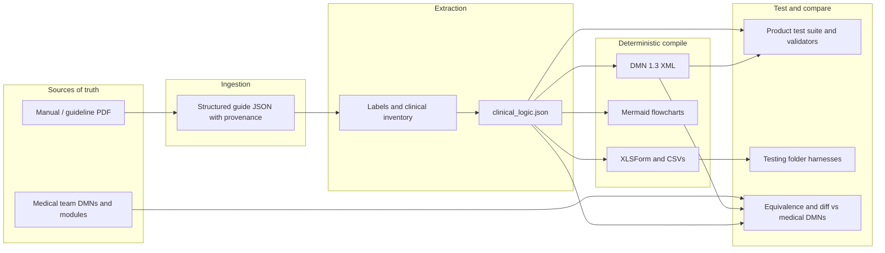

# CHW Navigator — information workflow

How **information flows** from a **CHW clinical manual** through **machine-assisted extraction**, into **clinical logic and DMN**, then through **automated testing** and **comparison to medical-team reference DMNs**.

For product philosophy and stakeholder value, see **`value_added.md`** at the repository root. For implementation detail, see **`Product/ARCHITECTURE.md`** and **`Product/PIPELINE.md`** (submodule).

---

## 1. High-level flow

---

## 2. Stage A — Manual in

| Step | What happens | Where in the repo |
|------|----------------|-------------------|
| A1 | **National or WHO PDF** (or MOH bundle) is the clinical source of truth. | Example inputs: `Guidelines/WHO CHW guide 2012.pdf`, `Guidelines/WHO Guidelines diarrhea & pneumonia 2024.pdf`; product copies under `Product/` for runs. |
| A2 | Optional **MOH addendum** closes gaps (stock-outs, ambiguous ages) before or between pipeline runs—human-in-the-loop, not inferred silently. | Described in `Product/CHW Navigator v1 (1).md` and `value_added.md`. |

---

## 3. Stage B — Manual to structured guide

| Step | What happens | Where in the repo |
|------|----------------|-------------------|
| B1 | PDF is **rendered** and sent through **Unstructured.io hi_res** (tables, layout, coordinates). | `Product/backend/ingestion/pipeline.py`, `unstructured_client.py`, `assembler.py` |
| B2 | Elements are **assembled into sections** (`guide_json`): titles, blocks, page references. | `Product/backend/ingestion/assembler.py` |
| B3 | Optional **vision** pass improves tables/diagrams. | `Product/backend/ingestion/vision.py` |
| B4 | **Cached by content hash** (e.g. Neon) so the same manual is not re-parsed every run. | `Product/backend/ingestion/cache.py` |

**Output:** **`guide_json`** — the canonical structured representation of the manual for downstream steps.

---

## 4. Stage C — Guide to clinical logic (internal IR)

| Step | What happens | Where in the repo |
|------|----------------|-------------------|
| C1 | Guide is **micro-chunked** for labeling. | `Product/backend/gen7/chunker.py` |
| C2 | Each chunk is **labeled** (clinical items: questions, thresholds, treatments, supplies, etc.). | `Product/backend/gen7/labeler.py` |
| C3 | Labels are **deduplicated** to an inventory fed into extraction. | Same module; `deduped_labels.json` in run outputs |
| C4 | A **REPL-based extraction** (Gen 7) builds **`clinical_logic.json`**: modules, router, predicates, phrase bank, integrative, variables, supplies. | `Product/backend/gen7/pipeline.py`, `Product/backend/rlm_runner.py` |
| C5 | **Validators** (deterministic + LLM-assisted “catchers” where configured) run on artifacts. | `Product/backend/validators/`, `Product/backend/prompts/validators/` |

**Output:** **`clinical_logic.json`** — boolean-oriented decision logic with provenance fields suitable for audit.

---

## 5. Stage D — Clinical logic to DMN and deployable artifacts

| Step | What happens | Where in the repo |
|------|----------------|-------------------|
| D1 | **Same JSON** is converted **deterministically** (no LLM) to **DMN 1.3 XML** for tooling and clinician review. | `Product/backend/converters/json_to_dmn.py` |
| D2 | **Mermaid** flowcharts for visual review. | `Product/backend/converters/json_to_mermaid.py` |
| D3 | **XLSForm** (e.g. CHT-oriented `form.xlsx`) and flat **CSV** extracts (predicates, phrases). | `Product/backend/converters/json_to_xlsx.py`, `json_to_csv.py` |

**Outputs:** `clinical_logic.dmn`, `flowchart.md`, `form.xlsx`, CSVs — all **derived from one** `clinical_logic.json`.

---

## 6. Stage E — Test suite (engineering)

These checks run **against pipeline outputs**, not against the Word manual directly.

| Layer | Purpose | Where in the repo |
|-------|---------|-------------------|
| **Unit tests** | Chunker, labeler, small pipeline stubs, converters, session manager, REPL runner behavior. | `Product/backend/tests/` (`pytest`) |
| **Structural validation** | Schema, naming, router shape, predicate references, etc. | `Product/backend/validators/` |
| **Z3 / formal checks** | Properties such as exhaustivity or consistency where wired for a run. | Documented in `Product/ARCHITECTURE.md`; UI panel `Z3Panel` |
| **Gate harness** | Repeat extractions and compare **stability** across modes or runs (research / quality). | `Product/backend/eval/gate_harness.py` |
| **Manual post-run checklist** | Open DMN in modeler, inspect XLSForm survey/calculate rows, Mermaid connectivity, costs. | `Product/ARCHITECTURE.md` §12.4 |

**Intent:** every merge keeps **ingestion → JSON → DMN/XLSForm** paths **regressed** on small fixtures; full-manual runs are **integration** and **budget** decisions.

---

## 7. Stage F — Medical team DMNs as reference

The **medical team** maintains **human-authored** decision tables (often in spreadsheets or DMN tools) that encode **teaching and “known good”** module logic—for example **cough / pneumonia**, **fever / malaria**, and consolidated **Navigator** modules.

| Artifact | Role in workflow | Where in the repo |
|----------|------------------|-------------------|
| Spreadsheet DMN tables | **Reference behavior** and teaching gold for comparison workshops | `Medical/SP26 Medical DMN Tables/` (`*.xlsx`) |
| Verification deck | Explains **verification-first** expectations for engineering | `Medical/Verification-First Clinical Engineering.pptx` |

These are **not** automatically consumed by the Gen 7 compiler today; they are the **clinical side of the bridge** for **manual or semi-automated diff**: same scenario → **expected classification / referral** from the medical workbook vs **pipeline DMN or JSON executor**.

---

## 8. Stage G — Compare pipeline output to medical DMNs

Comparison is **many-to-many**: JSON executor vs XML DMN vs XLSForm harness vs spreadsheet intent.

| Approach | What it compares | Where in the repo |
|----------|------------------|-------------------|
| **Gigi — `product_dmn_runner.py`** | Runs **`clinical_logic.json`** through router + module rules; logs outcomes for regression or diff. | `Testing/Gigi/README.md`, `Testing/Gigi/clinical_logic.json` |
| **Angelina — DMN XML path** | Parses **DMN**, preprocesses patients, batch runs; docs for **per-module inputs**. | `Testing/Angelina/dmn/`, `Testing/Angelina/dmn/docs/` |
| **Aaron — CHT harness** | Feeds **orchestrator XLSForm/XML** shape to **cht-harness**; checks answer ordering and conditional paths. | `Testing/Aaron/cht-harness/`, `Testing/Aaron/cht-api/` |
| **Workshop process** | Clinicians pick **synthetic cases** (including boundaries); medical spreadsheet vs **Mermaid / DMN / form** outcomes recorded in QA sheets or tickets. | Outside repo or in program QA tools |

**Goal:** show that **pipeline-derived DMNs** (and forms) **match or explain deviation** from **medical-team DMNs** on agreed scenarios; mismatches drive **manual errata**, **prompt changes**, or **bug fixes**.

---

## 9. End-to-end picture (one sentence per arrow)

**Manual** → **guide_json** (layout-aware parsing) → **labels + REPL** → **`clinical_logic.json`** (auditable IR) → **DMN + Mermaid + XLSForm** (deterministic) → **`Product` test suite + validators** → **`Testing/` harnesses** and **workshop comparison** against **`Medical/` reference tables**.

---

## 10. Related documents

| Document | Use |
|----------|-----|
| `README.md` | Folder map and submodule clone |
| `value_added.md` (repo root) | Why the system exists for MOH and partners |
| `handoff.md` | Engineering handoff and risks |
| `Product/ARCHITECTURE.md` | Gen 7 implementation truth |
| `Product/PIPELINE.md` | Long-horizon staged vocabulary (FACTSHEET, D1b patients, etc.) |

---

*If you add a new comparison harness, append a row to §8 and link the README from here.*
